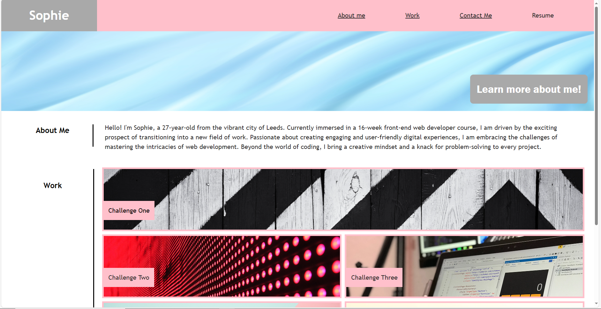
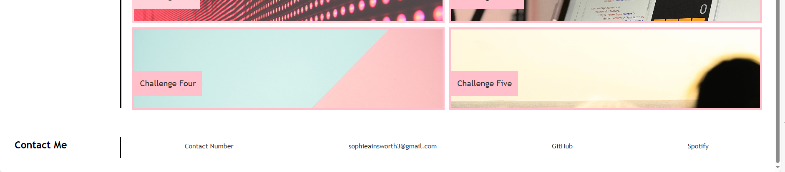

# project-showcase

For this project I created a portfolio of work to be able to showcase my skills and talents to potential employees in the future.
The page contains a small section of information about me as well a link to a previous challenge to show my work.
I have added placeholders to the other projects and will update these with relevant content when I have it available.
When clicked the navigation bar scrolls to the corresponding section of the page and the contact section on the page has hyperlinks, one being linked to my GitHub account.
The content showcases what I have learnt about flexboxes, media queries and CSS variables. I have added a hover feature to some elements and ensured the page is responsive when resized to a different screen size.

